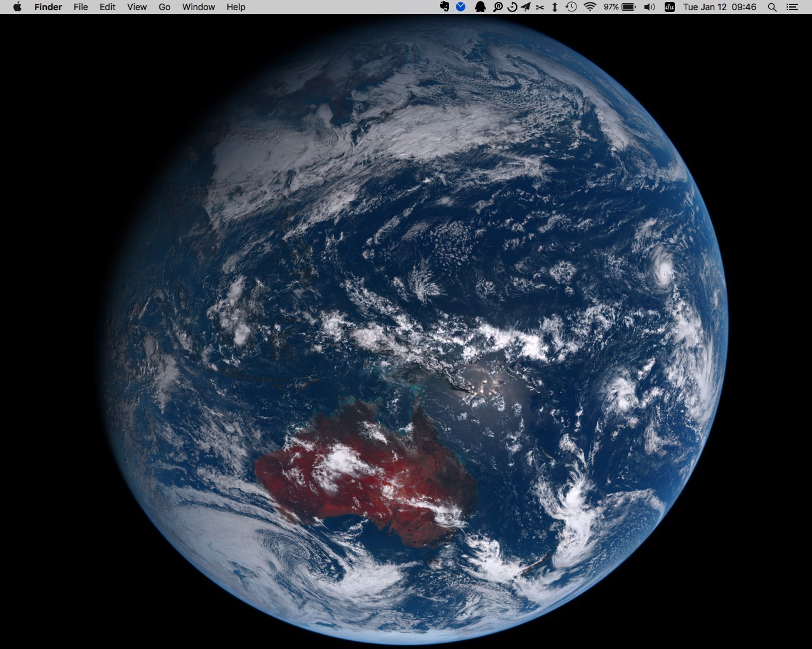

# the_earth
A brand-new way to see the earth.

Automaticly download picture of earth from [himawari8](http://himawari8.nict.go.jp) with high resolution. Set the latest one as your desktop. 

Writen in python and shell, works for Mac OSX.

Preview

